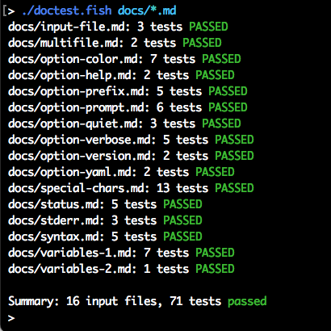

# doctest.fish - Test your documentation examples

Make sure all your [fish](https://fishshell.com/) command line examples work as documented.

## Testable documentation

You write something like the following in your documentation:

    ## The cut command

    You can use the `cut` command to extract parts of a text,
    using a delimiter:

        > set my_text 'foo:bar:baz'
        > echo $my_text
        foo:bar:baz
        > echo $my_text | cut -d : -f 1
        foo
        >

Wouldn't it be nice if some tool could scan your documentation, detect those special lines with fish commands and actually run those commands to make sure their output matches the documented ones? That's what `doctest.fish` does:

    > ./doctest.fish --verbose docs/include/example-cut.md
    docs/include/example-cut.md:6: [ ok ] set my_text 'foo:bar:baz'
    docs/include/example-cut.md:7: [ ok ] echo $my_text
    docs/include/example-cut.md:9: [ ok ] echo $my_text | cut -d : -f 1
    docs/include/example-cut.md: 3 tests PASSED

This very repository has many Markdown documentation files under the `docs/` directory. To test them all for the correctness of the mentioned commands, it's enough to run:

    ./doctest.fish docs/*.md

The output will be similar to the image shown in the top of this README.

## Features

- Use any textual format (Markdown, reST, HTML, plain text) for the [input files](docs/input-file.md)
- You can test both stdout and [stderr output](docs/stderr.md)
- You can also check the [command's exit status](docs/status.md) (`$status`)
- All the commands inside an input file share the same execution environment (i.e., [defined variables are preserved](docs/variables-1.md))
- KISS: A fish script to test fish commands.

## Usage

Click the option name to read its (testable) documentation.

<pre>
usage: doctest.fish [options] &lt;<a href="docs/input-file.md">file</a> ...&gt;

options:
      <a href="docs/option-color.md">--color</a> WHEN      use colors or not? auto*, always, never
      <a href="docs/option-prefix.md">--prefix</a> PREFIX   set the command line prefix (default: 4 spaces)
      <a href="docs/option-prompt.md">--prompt</a> PROMPT   set the prompt string (default: "&gt; ")
  -q, <a href="docs/option-quiet.md">--quiet</a>           no output is shown (not even errors)
  -v, <a href="docs/option-verbose.md">--verbose</a>         increase verbosity (cumulative)
      <a href="docs/option-version.md">--version</a>         show the program version and exit
      <a href="docs/option-yaml.md">--yaml</a>            show all test cases as YAML (no test is run)
  -h, <a href="docs/option-help.md">--help</a>            show this help message and exit
</pre>

## Meta

This is my first fish program, after using fish as my interactive shell for a couple of months.

The code is probably not idiomatic, since I'm still learning fish (and being a Bash-only guy since 1997 surely brings some "accent").

I'm the author of a similar software for POSIX shells: [clitest](https://github.com/aureliojargas/clitest). First I've tried porting that code to fish. It worked, but it felt weird because the `clitest` code is portable (therefore, ugly). Then I've rewrote it all from scratch, with fish features in mind (`argparse`, builtin arrays and color support).

With the rewrite, I took the opportunity the rethink how it works. The result is that this one is simpler, but also has some new concepts (such as the YAML dump). That's why I decided to call it differently.
