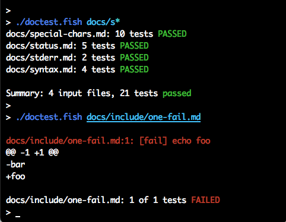

# Option --color

The `--color` option controls wether the output should use colors or not. For example, failed tests show up in red and a successful result is painted green.

These are the allowed values for `--color`:

- `auto` (the default value): Will use colors only if the output (stdout) is a terminal. If stdout is redirected to a file or is piped to another command, no colors will be used.

- `always` or `yes`: Always use colors, even when stdout is redirected to a file or a pipe.

- `never` or `no`: Never use colors.

## No colors

When no colors are wanted, just use `--color never` (or `--color no`) and no fancy color-related control characters will be printed. The output will always be just plain text:

    > ./doctest.fish --color never docs/include/one-ok.md
    docs/include/one-ok.md: 1 tests PASSED
    > ./doctest.fish --color no docs/include/one-ok.md
    docs/include/one-ok.md: 1 tests PASSED

## Maybe colors

The results for `--color auto` depends. The following commands, when copied and pasted to the interactive command line will output colors. But when the same commands are being automatically tested by doctest.fish, no colors will be used since the output is not a terminal:

    > ./doctest.fish --color auto docs/include/one-ok.md
    docs/include/one-ok.md: 1 tests PASSED
    > ./doctest.fish docs/include/one-ok.md
    docs/include/one-ok.md: 1 tests PASSED

## Use colors

Unfortunately, it's not so easy to show terminal-colored text in a Markdown/HTML document, since the control characters used to print the colors to the terminal are invisible.

One alternative to at least visualize part of the special color-related characters is removing the escape character (`tr -d '\033'`) so codes like `[32m` and `[m` will appear around the text that is meant to be colored green.

Applying that trick, `--color always` (and its alias `--color yes`) can be automatically tested here:

    > ./doctest.fish --color always docs/include/one-ok.md 2>&1 | tr -d '\033' | sed 's/(B//'
    docs/include/one-ok.md: 1 tests [32mPASSED[m
    > ./doctest.fish --color yes docs/include/one-ok.md 2>&1 | tr -d '\033' | sed 's/(B//'
    docs/include/one-ok.md: 1 tests [32mPASSED[m

> Note that an extra `sed` command is used to remove a possible `(B` that appears before `[m` only in some terminals (i.e.: `xterm-256color`).

## Invalid argument

Using an invalid value for the `--color` option will produce a non-colored error message:

    > ./doctest.fish --color 404 docs/include/one-ok.md
    doctest.fish: Error: Invalid --color mode '404'. Use: auto, always or never.
